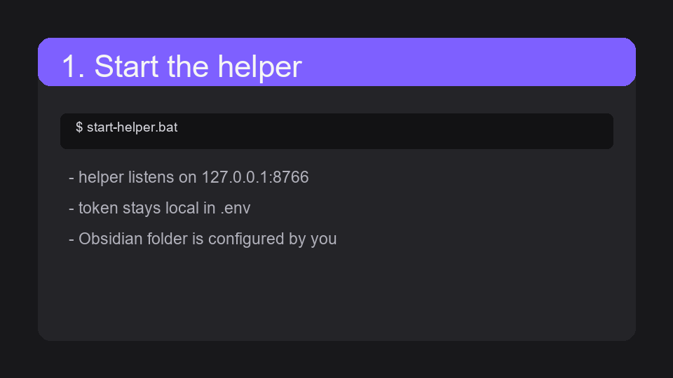
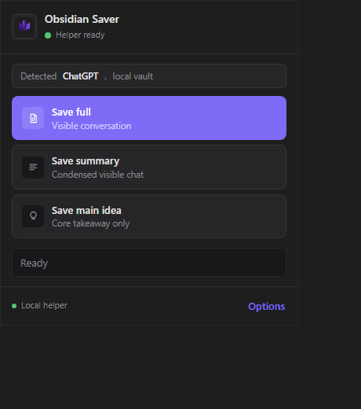
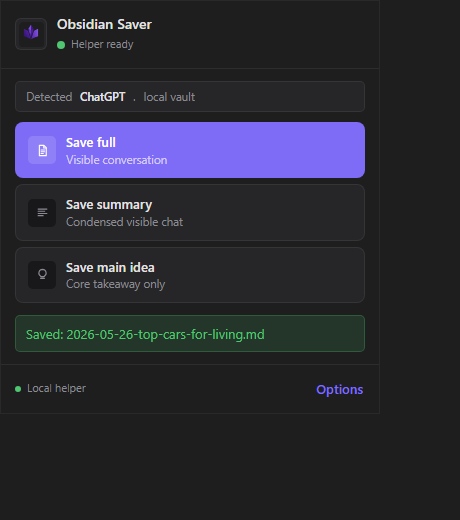
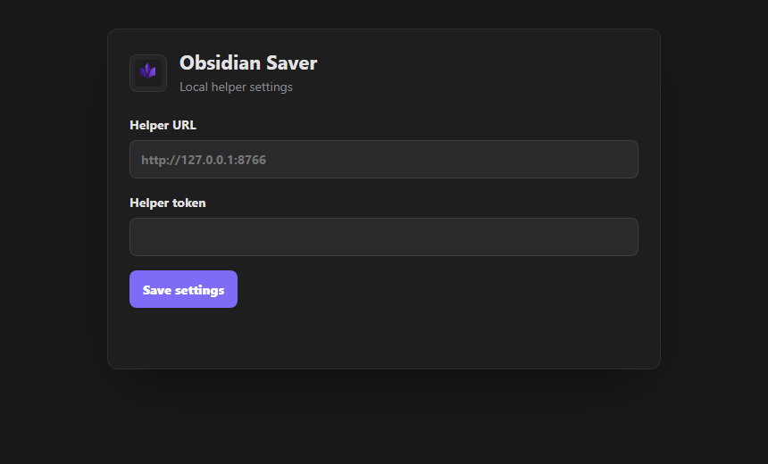

# Save to Obsidian

Turn a ChatGPT conversation into a clean local Obsidian note in one click.

[](https://github.com/Taan1el/save-to-obsidian/releases/latest)
[](LICENSE)
[](#why-local)
[](extension/manifest.json)

No Markdown downloads. No copy-paste cleanup. No provider API keys in the browser.



[Download the beta extension zip](https://github.com/Taan1el/save-to-obsidian/releases/latest) or jump to [Quick Windows setup](#quick-windows-setup).

If this saves you time, starring the repo helps more Obsidian users find it.

## Why local?

- Your vault stays on your computer.
- The extension talks only to your own `127.0.0.1` helper.
- Full saves work without any AI provider.
- Optional AI keys live in the helper `.env`, not in Chrome.
- The helper writes only inside the Obsidian folder you configure.

## What this is

Save to Obsidian is a Chrome/Brave extension plus a tiny local helper app.

The extension reads the visible ChatGPT conversation. The helper writes a clean Markdown note into your vault.

```text
ChatGPT -> browser extension -> 127.0.0.1 helper -> Obsidian vault
```



## What it can do

- Save the visible ChatGPT conversation as Markdown.
- Add YAML frontmatter with title, date, URL, tags, and save mode.
- Save into a folder you choose inside your Obsidian vault.
- Create summaries and main-idea notes with Ollama or your own AI provider key.
- Keep provider keys out of the extension.

## What it will not do

- It will not silently auto-save your chats.
- It will not write files directly from the browser extension.
- It will not upload your conversations anywhere by itself.
- It will not store OpenAI, Anthropic, Gemini, or other provider keys in Chrome.

## Quick Windows setup

### 1. Get the project

Clone or download this repo somewhere normal, for example:

```text
C:\Users\YOUR_NAME\Documents\save-to-obsidian
```

### 2. Set up the helper

Open PowerShell in the project folder:

```powershell
powershell -NoProfile -ExecutionPolicy Bypass -File .\scripts\setup-helper.ps1 -VaultPath "C:\Users\YOUR_NAME\Documents\Obsidian Vault"
```

That creates:

- `.venv`
- `.env`
- a random helper token
- the Python packages

### 3. Start the helper

Double-click:

```text
start-helper.bat
```

Leave that window open while saving chats.

To check it:

```powershell
Invoke-RestMethod http://127.0.0.1:8766/health
```

You want:

```json
{"ok":true}
```

### 4. Load the extension

1. Open `chrome://extensions` or `brave://extensions`.
2. Turn on `Developer mode`.
3. Click `Load unpacked`.
4. Pick the `extension` folder from this repo.
5. Pin the extension if you want.

### 5. Connect the extension to the helper

Open the extension popup and click `Options`.

Use:

```text
Helper URL: http://127.0.0.1:8766
Helper token: the HELPER_TOKEN value from .env
```

The token is local. It is just there so random web pages cannot ask your helper to write notes.

### 6. Save a chat

Open a ChatGPT conversation, click the extension, then click:

```text
Save full
```

Obsidian should see the new note right away.

Default save folder:

```text
AI Chats\ChatGPT\Saved
```

## Summary and main idea

`Save full` does not need AI.

`Save summary` and `Save main idea` need an AI provider configured in the helper.

Free/local option:

```powershell
winget install Ollama.Ollama
ollama pull llama3.2
ollama serve
```

Then keep this in `.env`:

```env
AI_PROVIDER=ollama
OLLAMA_BASE_URL=http://127.0.0.1:11434
OLLAMA_MODEL=llama3.2
```

Cloud providers are optional. Put those keys in `.env`, never in the extension.

Supported helper providers:

- `ollama`
- `openai`
- `anthropic`
- `gemini`
- `openai-compatible`

## Screenshots






## Build a beta zip

Run:

```powershell
powershell -NoProfile -ExecutionPolicy Bypass -File .\scripts\validate.ps1
powershell -NoProfile -ExecutionPolicy Bypass -File .\scripts\package-extension.ps1
```

The zip lands in `dist\`.

## Troubleshooting

`Helper not running`

Start `start-helper.bat`, then check `/health`.

`Unauthorized`

The helper token in extension options does not match `HELPER_TOKEN` in `.env`.

`Could not extract conversation`

Reload the ChatGPT tab and try again. ChatGPT changes its page HTML sometimes.

`Ollama is not running`

Start Ollama with:

```powershell
ollama serve
```

## Security basics

- Helper listens on `127.0.0.1`.
- Extension calls the helper with a local token.
- Helper writes only inside the configured vault folder.
- The extension never receives provider API keys.
- `.env` is ignored by git.

## More docs

- [Privacy](PRIVACY.md)
- [Security](SECURITY.md)
- [Store listing draft](STORE_LISTING.md)
- [Publishing guide](docs/PUBLISHING.md)
- [Beta checklist](docs/BETA_RELEASE.md)
