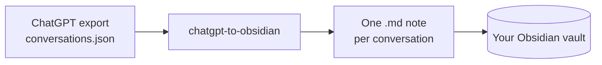

# chatgpt-to-obsidian

Turn your ChatGPT history into clean Obsidian notes — one markdown file per conversation, with proper frontmatter, no fuss.

I made this because my ChatGPT chats kept piling up somewhere I never looked at again. They belong in my notes, next to everything else I think about. So this takes the export ChatGPT gives you and drops it into your vault as real, searchable, linkable notes.

No accounts, no API keys, no cloud anything. It's one small script that runs locally and only uses Node's built-ins.



## What you get

Each conversation becomes a note like this:

```markdown
---
title: "Weeknight pasta ideas"
source: ChatGPT
created: 2024-05-20
model: "gpt-4o"
tags: [chatgpt]
---

# Weeknight pasta ideas

> **You** · 2024-05-20 10:13

Give me 2 quick weeknight pasta ideas.

> **ChatGPT** · 2024-05-20 10:14

1. **Cacio e pepe** — pecorino, black pepper, pasta water.
2. **Aglio e olio** — garlic, olive oil, chili flakes, parsley.
```

It handles the annoying parts of ChatGPT's export for you:

- **Branches.** When you regenerate or edit a message, ChatGPT keeps every version in a tree. This follows the *active* branch (the answers you actually kept) and ignores the dead ends.
- **Hidden system messages** are skipped.
- **Code blocks** keep their language and formatting.
- **Messy titles** get turned into safe filenames, and same-name chats don't overwrite each other.
- **Empty conversations** are skipped.

## How to use it

**1. Get your export from ChatGPT.**
In ChatGPT: **Settings → Data controls → Export data → Export**. You'll get an email with a `.zip` (can take a few minutes). Unzip it — the file you want is `conversations.json`.

**2. Run the script.**
You'll need [Node.js](https://nodejs.org) (v18+). Then:

```bash
node chatgpt-to-obsidian.mjs path/to/conversations.json
```

By default the notes land in a `./chatgpt-export` folder. To send them straight into your vault, add the folder as a second argument:

```bash
node chatgpt-to-obsidian.mjs conversations.json "/path/to/your/vault/ChatGPT"
```

That's it. Open the folder in Obsidian and your chats are there.

## Want to try it first?

There's a `sample-conversations.json` in this repo with the same structure as a real export. Run the script against it to see what the output looks like before you touch your own data:

```bash
node chatgpt-to-obsidian.mjs sample-conversations.json
```

## Re-running later

Run it again whenever you want a refresh. Notes use the conversation's date in the filename, so old chats overwrite cleanly (picking up any new messages) and new chats just get new files.

## Live-saving from a custom GPT (optional)

This script does batch imports. If you'd rather save chats *as you have them*, there's a small bonus in [`custom-gpt/`](./custom-gpt) showing how to build a custom GPT that writes notes straight into a GitHub repo your vault syncs from. Read the limits there first — it only captures chats inside that one GPT.

## A note on your privacy

Your `conversations.json` is your entire chat history — treat it like a diary. This repo's `.gitignore` is set up so you can't accidentally commit it. The script never sends your data anywhere; it just reads the file and writes markdown.

## License

MIT — do whatever you like with it.
